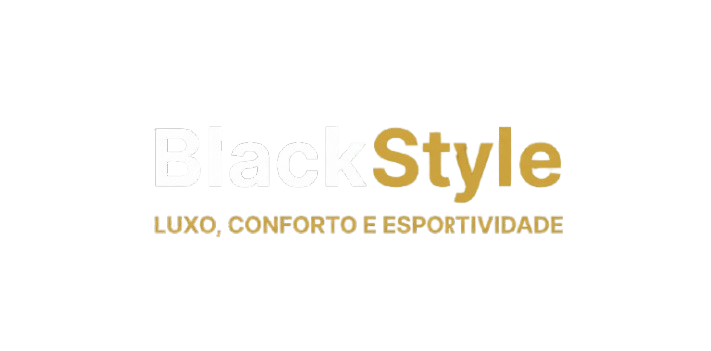

  

# Projeto BlackStyle — Web Front-end

Seja bem-vindo ao repositório do projeto **BlackStyle**, uma plataforma de e-commerce fictícia desenvolvida como requisito avaliativo para a disciplina de **Desenvolvimento Web Front-end**.

O projeto consiste no design e desenvolvimento da interface de uma loja de roupas e calçados focada no estilo **esportivo e urbanista masculino**, buscando de forma conceitual unificar a sofisticação das linhas modernas ao conforto do *streetwear*.

---

## Componentes do Grupo
* **Francislayne Nobre** * **Maria Lara**
* **Vitória Beniz**
* **Yuri Souza**

---

## Sobre a Black Style
> "A fusão perfeita de estilo, conforto e performance."

A Black Style nasceu com a missão de unir elegância, tecnologia e performance no mundo esportivo. Cada produto é pensado para oferecer conforto e estilo, seja no treino, no jogo ou no dia a dia. Somos movidos por design e paixão pelo esporte. Nossa meta é elevar a experiência do cliente, oferecendo produtos com materiais premium e acabamento impecável.

* **Estética Visual:** Uso de paleta de cores predominantemente escura (*Dark Mode* conceitual) para transmitir sofisticação e minimalismo, equilibrada com contrastes urbanos em tom dourado/ouro.
* **Foco do Produto:** Roupas, calçados e acessórios de alta durabilidade, tecnologia de performance e estética *premium*.

---

## Tecnologias Utilizadas

A construção do ecossistema do front-end seguiu as diretrizes e boas práticas de desenvolvimento web estruturado:

| Tecnologia | Função no Projeto |
| :---: | :--- |
| **HTML5** | Estruturação semântica de todas as páginas da loja (Navbar, Seções, Cards de Produtos, Rodapé). |
| **CSS3** | Estilização avançada, identidade visual da marca, efeitos de sobreposição (*overlays*) e aplicação de *Layout Responsivo*. |
| **JavaScript** | Implementação de interatividade com o usuário (ex: comportamento de menus, filtros de produtos ou manipulação do carrinho). |

---

## Responsividade e UI/UX
Preocupados com a experiência do usuário (*User Experience*), a interface foi projetada utilizando regras de **Design Responsivo**, garantindo uma navegação fluida, intuitiva e esteticamente agradável tanto em monitores de Desktop quanto em telas menores de tablets e smartphones.